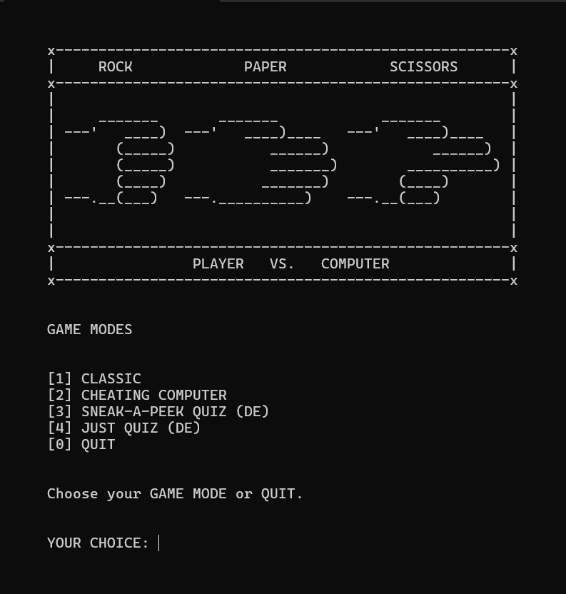

# project_RPS

A DOS-style Rock Paper Scissors game built in Python, featuring ASCII animations, sound effects, and multiple gameplay modes including quiz mechanics.

---

## Screenshot

*Main Menu of the game (Windows CMD)*

---

## Status
Current version: v5.0-dev
Last stable release: v4.0-stable

Designed for Windows CMD (.bat startup).

---

## Project Overview

This project started as a simple Rock Paper Scissors game and evolved into a modular terminal-based application with multiple gameplay variations.

The UI is intentionally designed in a classic DOS style:
- Fixed layout (no scrolling)
- ASCII art animations
- Real-time updates using cursor control
- Sound effects for animations

---

## Game Modes

Currently, 4 game modes are available:

### Classic
Standard Rock Paper Scissors gameplay.
Win condition: at least 3 points with a score difference of 2.

---

### Cheating Computer
Extension of Classic mode.
The computer gains an increasing probability of winning rounds over time.

---

### Sneak-a-Peek Quiz
A hybrid of gameplay and learning:

- Each round includes a quiz question
- Correct answers grant a +10% bonus chance
- Bonus allows the player to automatically counter the computer’s move
- Chance increases up to 100%
- Wrong answers give no bonus

Additional features:
- Questions are selected randomly
- Already answered questions are tracked using a cache system
- Players can clear cache or switch learning fields when completed

(Currently uses placeholder questions for testing and proof of concept.)

---

### Just Quiz
Standalone quiz mode without gameplay.

- Same question system as Sneak-a-Peek Quiz
- Used for testing and concept validation

(Currently uses placeholder questions.)

---

## Changelog

### v5.0-dev
- Added "Just Quiz" mode with test questions for learning fields 1–6
- Implemented question system with random selection and YES/NO input
- Added caching system (game_loop_just_quiz_cache.txt & game_loop_sneak_a_peek_quiz_cache.txt) to track correctly answered questions
- Cache reset functionality implemented per learning field

- Added in-game menus and mode selection
- Expanded to 4 game modes:
  - Classic
  - Cheating Computer
  - Sneak-a-Peek Quiz
  - Just Quiz mode

- Implemented Sneak-a-Peek mechanic:
  - Correct answers increase chance (+10%)
  - Player may automatically counter the computer's move
  - Bonus chance scales from 0% to 100%
  - Wrong answers give no bonus

- Added sound effects to all animations
- Improved startup:
  - .bat launches in maximized window
  - "Press Enter to start" before main menu

- Reworked game loop structure to support multiple modes
- Added option to return to main menu from game

- Current limitation:
  - Heavy flickering originally occurred on every frame
  - Temporary workaround: removed os.system("clear/cls") from animation loops and replaced it with cursor reset using sys.stdout.write + flush
  - Minor flickering still appears in certain parts due to multiple animation loops
  - Planned improvement: unified frame system with per-frame delays using (frame, delay)

---

### v4.0-stable
- Introduced "Cheating Computer" mode based on classic gameplay
- Considered stable after final gameplay testing

- Code fully documented
- Centralized imports via `__init__.py` and `__all__`

- Added start menu ("Start game? Yes/No")

- Replaced static ASCII art with animated frames
- Implemented animation system in `game_animations.py`

- Completed animations:
  - Rock / Paper / Scissors (draw, win, final win)

- Added still frames:
  - Loss states
  - Computer win

- Design decision:
  - No flipped animations for losses to improve game flow
  - Focus remains on player wins and draws

---

### v3.0
- Introduced progressive cheating system:
  - 25% chance (early rounds)
  - 50%, 75%, up to 100% in later rounds

- Added display for:
  - Normal state
  - Cheating status

- Minor code restructuring for feature expansion
- Added comments to `game_start.bat`

---

### v2.0
- General code cleanup

- Improved input validation:
  - No try/except required
  - Custom validation logic implemented

- Introduced `.bat` file for CMD execution:
  - Screen stays static (no scrolling)
  - Screen cleared before redraw (`os.system("clear/cls")`)

- Implemented input overwrite:
  - Invalid input is removed instantly
  - Re-entry without adding new lines (`sys.stdout.write + flush`)

---

### v1.0
- First working prototype

- Basic Rock Paper Scissors logic implemented
- Placeholder ASCII art for game states

- Initial modular structure:
  - Code separated into `game_modules`
  - Included `__init__.py`
